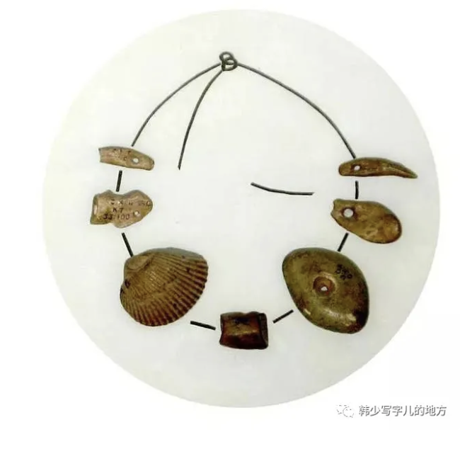
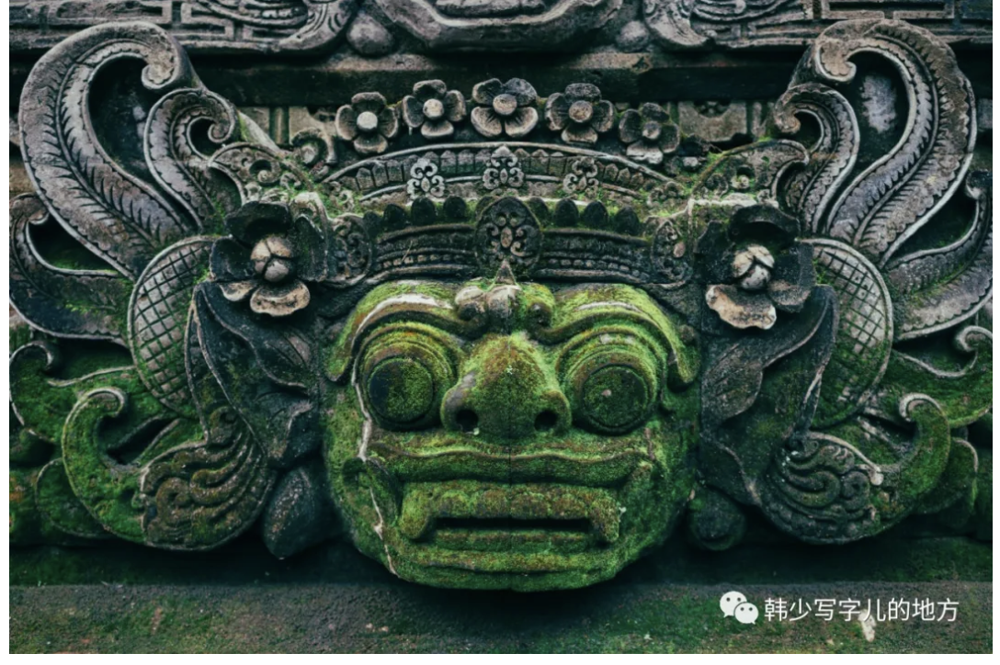

## 龙飞凤舞的远古时期

当山顶洞人在尸体旁撒上矿物质的红粉，当他们开始做出一些非功利的、带有装饰意味的工具时，是一种巨大的跨越，这便是人类社会意识形态和上层建筑的开始。而这种初始的社会意识的成熟形态便是原始社会的巫术礼仪——图腾崇拜。

（这是一个关键节点，代表人类开始不满足于动物性的生存，开始追求生存的意义而非生存本身。像史铁生说的，自杀是人的光荣品质，是追求生活而非生存的壮烈牺牲，是人与动物的分界。这种不易满足，或许是人类刻在基因里的骄傲。而这种骄傲的起点，某种意义上也许正是在尸体旁撒上红粉的那个瞬间：人第一次不再只把死亡当作生物事件，而是试图赋予它情感、仪式与意义。也正是在那一刻，人真正开始成为“会追问意义的动物”。）

龙的形象，是由蛇加上各种动物而形成的。以蛇身为主体，接受了兽类的四脚、马的毛、鹿的脚、狗的爪、鱼的鳞和须。这或许意味着以蛇图腾为主的远古华夏族不断战胜、融合其它氏族部落，蛇图腾逐渐演变为龙。

龙蛇是中国西、北、南部的许多部落的图腾，而东方的图腾，是凤。龙飞凤舞，就是夏商前中国大地上飞扬着的两面光辉的图腾。

图腾崇拜以神秘感为核心，凝练在种种符号图像当中，使人们获得超感觉的主观价值，给原始人们带来一种火一般的、如醉如狂的情感，这正是审美意识和艺术创作的萌芽。它们浓缩着原始人们强烈的情感、思想、信仰和期望。

（这是西方酒神精神对应的东方版本。神秘是有魅力的，它不够理性，甚至常常故意拒绝被看清，但也正因如此，才更能激起想象、敬畏与沉醉。美有时候并不来自彻底的明晰，恰恰来自那种似懂非懂、若即若离的张力。由此看来，理性未必是美的必要条件，它更像是美的一种形态；而神秘所制造的距离感，本身也是美感的重要来源。宗教之所以有吸引力或许就源于此。）

远古图腾歌舞作为巫术礼仪，是具有观念内容和情节意义的，而这情节意义就是戏剧和文学的先驱。

（这很有意思，因为艺术一开始也许就不是为了单纯的“好看”，而是为了沟通神灵、凝聚族群、确认秩序。戏剧和文学的起点可能并不在书写，而在仪式；不在个人抒情，而在共同体的精神行动，审美体验的一大快感就是对记忆的唤醒。）

继神人同一的龙凤图腾之后，便是以父长制为社会基础的英雄崇拜和祖先崇拜。从女娲到黄帝、从蚩尤到后羿、尧舜禹，以神秘巫术为内核的神话不断人间化和理性化，巫术礼仪和原始图腾逐渐让位于有政治作用的英雄神话。

（神话能够带来集体认同和共同权威，因此它既能赋予人精神力量，也天然可能被统治秩序所借用。它让人们相信自己从何而来、为何而活、应当服从什么，于是神话一面是族群精神的源泉，一面也可能是权力合法性的来源。与其说某些神话带有宗教性，不如说宗教本身就是一种系统化了的神话叙事。它把零散的想象、敬畏和传说，变成了一整套稳定的意义结构。）

美是一种“有意味的形式”，它沉淀了社会内容的自然形式。

新石器时代早期的陶器纹饰大部分是图腾崇拜，而图腾逐渐演化为抽象的几何图案，这是早期的几何形式美。

（它像是在提醒我们，艺术的一大特点就是抽象，在人类文明很早的时候，抽象就已经出现了，而且往往与最原始的精神活动紧密相连。也许绘画和文字的源头，本就不是单纯地模仿现实，而是把现实、信仰和秩序压缩成符号。抽象不是远离世界，抽象有时反而是更高密度地概括世界。）

陶器的几何美是线的美：现实世界的节奏、韵律、对称、均衡、连续、间隔、重叠、单独、粗细、疏密、反复、交叉、错综、一致、变化、统一等种种形式规律，被集中表现在线的形式中。

（线几乎贯穿了中国艺术的一条深层脉络：书法是线，水墨是线，器具纹样是线，建筑的飞檐斗拱也有线的走势，甚至音乐的旋律、气口与行进感，某种意义上也可以被理解为听觉中的“线”。所以线不只是造型手段，它更像是一种中式感知方式：人们通过线去把握节奏、气韵、张力与生命运动。线之所以重要，不只是因为它好看，而是因为它最适合承载“势”。）

从河姆渡开始，猪的驯化饲养是中国早期民族一大特征，被驯化的猪有两个特点，圈养和吃饲料，它们分别标志着定居早和精耕细作早。

（这很有意思。被驯化的猪意味着圈养、定居、饲料、农耕、稳定的生活秩序，也意味着人和土地之间的关系已经越来越深。这样看，猪肉在中国人饮食中的偏爱，或许真的不只是口味问题，它背后连着的是一整套农耕文明的生活方式。某些饮食偏好看似日常，实则深深嵌在文明史里。食物从来不只是食物，它也是文化结构的一部分。怪不得我们中国人偏爱猪肉，猪肉已不再只是食物，还是历史的进程。）

新石器时代晚期的陶器要远比早期更神秘、威吓、严峻、恐怖，具体表现在直线压倒曲线，封闭重于连续，圆弧让位于直角，令人感到清晰的权威统治力量。这或许是因为神农氏的相对和平稳定时期过去，社会进入了战乱频繁的黄帝、尧舜时代。

（艺术风格的变化往往不是偶然的审美偏好，而是社会心理变化的外显。当一个时代的生存压力、战争频率、权力结构都发生变化时，艺术中的线条、造型、节奏、空间关系也会随之改变。艺术并不是时代的注脚，它本身就是时代精神最敏感的记录仪。将艺术放回其所处社会中理解，很多原本抽象的美学风格就会突然变得非常具体。也正因如此，将属于一个时代的艺术从当时社会的角度解构，往往会使艺术的整体结构清晰无比，也让我们更接近美到底是什么这个问题。）

战乱频繁的新石器时代晚期，作为一个历史节点，开启了更为暴力的青铜时代。陶器纹饰的美学风格由活泼愉快走向沉重神秘，确是走向青铜时代的无可置疑的实证。

经历了龙飞凤舞的远古时期，下一段旅程，叫做青铜饕餮。
