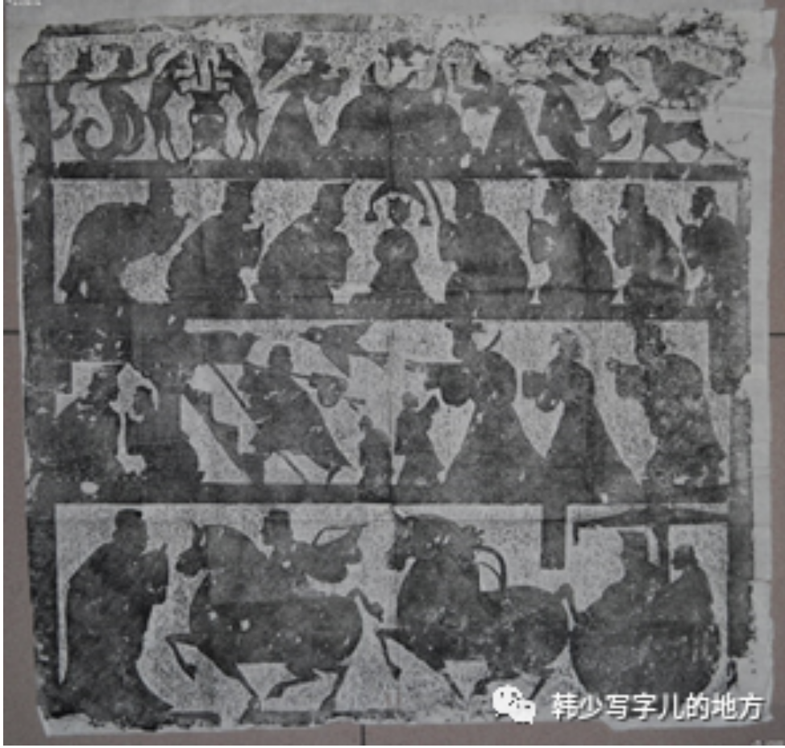
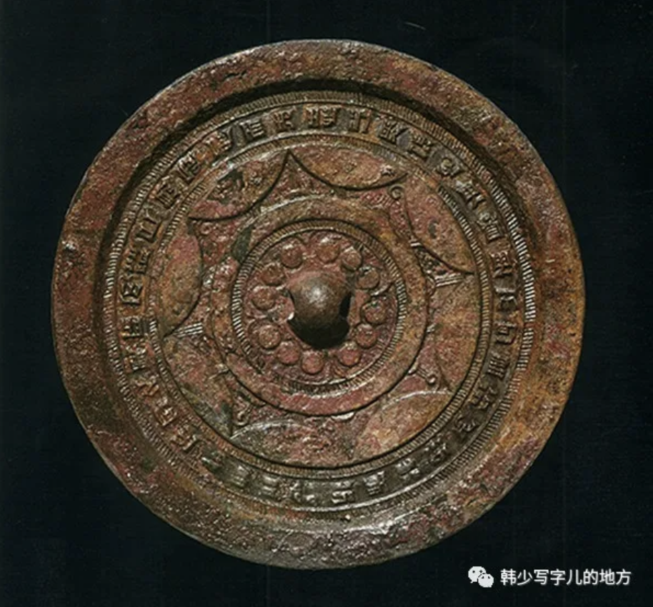
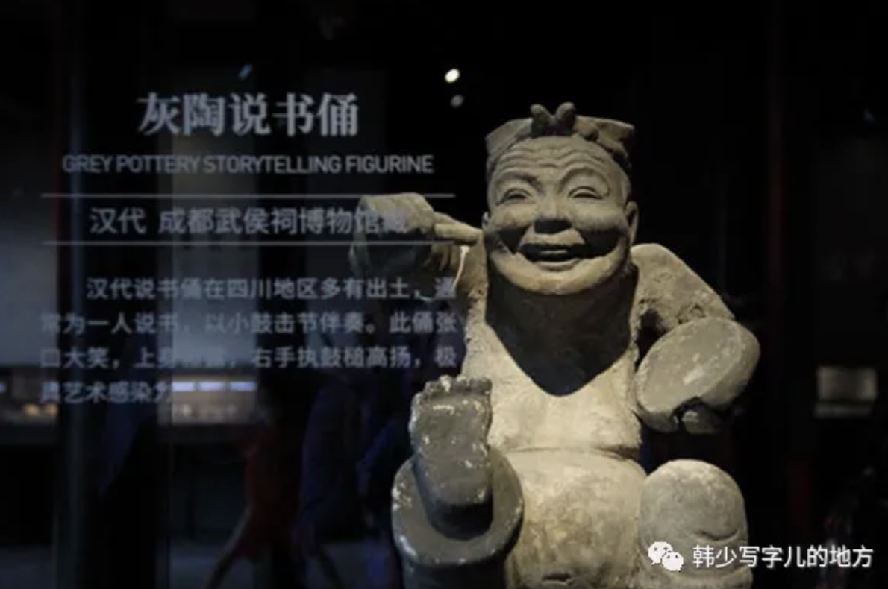

## 屈骚传统

当理性精神在北中国节节胜利，从孔子到荀子，从名家到法家，都逐渐摆脱巫术宗教的束缚时，南中国由于原始氏族社会结构有更多的保留和残存，便强有力地保持着绚烂的远古传统。从《楚辞》到《山海经》，从庄周到“宽柔以教不报无道”的“南方之强”，在意识形态各领域，依然弥漫在一片奇异炽烈的神话世界中。表现在文艺审美领域，就是以屈原为代表的楚文化。

在充满神话想象的自然环境里，主人翁却是这样一位执着、顽强、忧伤、愤世嫉俗、不容于时的真理追求者。《离骚》把只有在神话故事中才能出现的那种无羁的浪漫想象、与只有在理性觉醒时刻才能有的个人人格和情操，最完美地溶化成了有机整体。由是，它开创了中国抒情诗的真正光辉起点和无可比拟的典范：

忽反顾以游目兮，将往观乎四荒。佩缤纷其繁饰兮，芳菲菲其弥章。民生各有所乐兮，余独好修以为常。虽体解吾犹未变兮，岂余心之可惩。  

朝发轫于苍梧兮，夕余至乎县圃。欲少留此灵琐兮，日忽忽其将暮。吾令羲和弭节兮，望崦嵫而勿迫。路漫漫其修远兮，吾将上下而求索。

（这说明屈骚传统并不是一块孤立的文学瑰宝，而是一整条文化脉络。它不是只属于屈原个人，而是属于一个区域、一个时代、一种持续的精神气候。后来汉代艺术的浪漫、夸张、铺陈、神怪、宏阔，其实都还能看到楚文化的影子。好的传统往往就是这样，它不会只停留在一个作品里，而会变成一种长期流动的审美基因。）

从西汉到东汉，经历了“罢黜百家，独尊儒术”的意识形态重大变革，先秦理性精神也日渐濡染入文艺领域和人们观念中，逐渐将儒学的道德节操与道家的荒忽之谈融为一体，造成了一个想象混沌而丰富、情感热烈而粗豪的浪漫世界。像这块东汉画像石的图景，神话志怪依然存在，但人本身已是图景中不可缺少的一部分了：

（这一点很关键。神话没有完全消失，但“人”已经走进了画面中心，这甚至是中国早期的“文艺复兴”。也就是说,艺术不再只是对神秘力量的畏惧性描绘，而开始更多承载人的愿望、人的想象、人的行动和人的存在感。这其实是一种非常深刻的变化：神话世界还在，但它正在慢慢人间化。人在不知不觉中，已经从仰望神秘，走向把自己放进宇宙图景之中。）

比起马王堆帛画来，原始神话毕竟在相对地褪色。人世、现实日益占据重要的位置，这是社会发展文明进步的必然结构。但是，蕴藏着原始活力的传统浪漫幻想，却始终没有离开汉代艺术。相反，它们乃是楚汉艺术的灵魂。那是一个充满了幻想、神话、巫术观念，充满了奇禽异兽和神秘的符号、象征的浪漫世界。

## 二、琳琅满目的世界

尽管儒家和经学在汉代盛行，但汉代艺术的特点却恰恰是，它并没有受到儒家狭隘的功利信条束缚。刚好相反，它通过神话跟历史、现实和神、人与兽同台演出的丰满形象画面，极有气魄地展示了一个五彩缤纷、琳琅满目的世界。人对客观世界的征服，是汉代艺术的真正主题。

（汉代最迷人的地方，也许就在这种强烈的“向外扩张感”。它不沉溺于内心幽微，也不沉溺于宗教恐惧，而是以一种非常饱满、非常外放、非常有行动感的方式拥抱世界。山河、宫阙、神怪、车马、鸟兽、人物、器物，全都涌进同一个宏大画面里。那不是单纯的装饰繁复，而是一种文明初步壮大后的自信。）

你看那神仙世界。它不同于后代六朝时期的佛教迷狂。这里没有苦难的呻吟，而是愉快的愿望，是对生前死后都有永恒幸福的追求。这里的神仙世界不是与现实苦难相对峙的难及彼岸，而是好像就存在于与现实人间相距不远的此岸之中。它们不再具有青铜饕餮在现实中的威吓权势，毋宁带着更浓厚的主观愿望的色彩。汉代艺术图景尽管有些是如此荒诞不经，迷信至极，但其艺术风格和美学基调既不恐怖也不消沉，毋宁是愉快乐观、积极开朗的。它不是神对人的征服，毋宁是人对神的征服。

（这句话说得非常好：不是神对人的征服，而是人对神的征服。汉代的神仙世界之所以有意思，不在于它真不真，而在于它明显已经带上了人主动投射愿望的色彩。人不再只是被神压住，而是在想象中改造神界、占有神界、让神界服务于自己的幸福愿望。这种精神气质非常重要：它意味着汉代的浪漫不是阴冷的逃避，而是热烈的扩张；不是消极地向彼岸哀求，而是积极地把彼岸也纳入自己的生活愿景里。）

汉赋，虽然从楚辞脱胎而来，然而“不歌而诵谓之赋”，却已是脱离原始歌舞的纯文学作品了。从《子虚》、《上林》到《两都》、《两京》，都是状貌写景，铺陈百事的。尽管有所谓“讽喻劝诫”，但作品的主要内容仍在极力夸扬、尽力铺陈天上人间的各类事物：山如何、水如何、树木如何、鸟兽如何、城市如何、宫殿如何、美女如何、衣饰如何……充满了汉赋的不正是这种铺张描述么：

臣闻楚有七泽，尝见其一，未睹其余也。臣之所见，盖特其小小耳者，名曰云梦。云梦者，方九百里，其中有山焉。其山则盘纡茀郁，隆崇嵂崒；岑崟参差，日月蔽亏；交错纠纷，上干青云；罢池陂陀，下属江河。其土则丹青赭垩，雌黄白坿，锡碧金银，众色炫耀，照烂龙鳞。其石则赤玉玫瑰，琳瑉琨吾，瑊玏玄厉，碝石碔玞。其东则有蕙圃：衡兰芷若，芎藭昌蒲，茳蓠麋芜，诸柘巴苴。其南则有平原广泽，登降陁靡，案衍坛曼。缘以大江，限以巫山。其高燥则生葴菥苞荔，薛莎青薠。其卑湿则生藏莨蒹葭，东蔷雕胡，莲藕觚卢、菴闾轩于，众物居之，不可胜图。其西则有涌泉清池，激水推移，外发芙蓉菱华，内隐钜石白沙。其中则有神龟蛟鼍、瑇瑁鳖鼋。其北则有阴林：其树楩柟豫章，桂椒木兰，蘖离朱杨，樝梨梬栗，橘柚芬芳；其上则有鹓雏孔鸾，腾远射干；其下则有白虎玄豹，蟃蜒貙犴。

尽管是那样堆砌、重复、拙笨、呆板，但是江山的宏伟、城市的繁荣、商业的发达、物产的丰饶、服饰的奢侈、人物的气派……无不刻意描写，着意夸张。它们所力图展示的，不正是一个繁荣富强、充满活力、自信和对现实具有浓厚兴趣的图景么？尽管呆板堆砌，但它在描述领域、范围、对象的广度上，却确乎为后代文艺所再未达到。汉代文艺尽管粗重拙笨，却如此心胸开阔，气派雄沉，其根本道理就在这里。它表明中华民族进入发达的文明社会后，对世界的直接征服和胜利。

（有时候“拙”未必就是缺点。汉代艺术和文学的魅力，恰恰在这种不够精巧却足够雄浑的状态里。后世当然更精细、更圆熟、更讲究个人情调，但那种初入盛世、四面张望、处处铺开、恨不得把整个世界都卷进作品里的开阔气象，却很难再有了。汉代的伟大，不在于微妙，而在于阔大；不在于细密，而在于有一股压不住的生命力和征服欲。）

与汉赋、画像石、壁画同样体现了这一时代精神而保存下来的，是汉代极端精美并且可以说是空前绝后的各种工艺品。所以能如此，乃由于它们是战国以来到西汉已完全成熟、处于顶峰状态中的工匠集体手工业的成功所致。（世代相袭，不计时间、工力）其工艺水平都不是后代官营或家庭手工业所能达到或效仿，正如后世不再可能建造埃及金字塔那样的工程一样。作为世代奴隶的巨大劳动的产物，它们留下来的是使后人瞠目结舌的惊叹。

（每次看到这些工艺品，都会有一种很复杂的感受：一方面是纯粹的震撼，惊叹于那种不可思议的技术和审美完成度；另一方面又无法忽视，它们背后往往是巨大、漫长、沉默且不被看见的劳动。宏伟文明的辉煌，常常正是建立在无数具体身体的消耗之上。美当然仍然是美，但当我们意识到它的代价时，对美的理解也会更深一层：它不再只是形式的灿烂，也带上了历史的重量。）

## 三、气势与古拙

人对世界的征服和琳琅满目的对象，表现在具体形象、图景和意境上，则是力量、运动和速度，它们构成汉代艺术的气势与古拙的基本美学风貌。

（这很能概括汉代艺术的核心气质。它不靠精巧取胜，也不靠幽深取胜，而是靠一种扑面而来的“势”。力量、运动、速度——这几个词几乎一下就把汉代同后世区分开了。后来的艺术越来越重神韵、重静观、重内敛，而汉代仿佛还站在一个文明气血正盛的阶段，凡事都带着一种要冲出去、要展开、要压过来的劲道。）

这里统统没有细节，没有修饰，没有个性表达，也没有主观抒情。相反，突出的是高度夸张的形体姿势，是手舞足蹈的大动作，是异常简单的整体形象。这是一种粗线条粗轮廓的图景形象，然而，整个汉代艺术生命也就在这里。一往无前不可阻挡的气势、运动和力量，构成了汉代艺术的美学风格。它与六朝以后的安详凝练的静态姿势和内在精神，是何等鲜明的对照。

如果拿汉代艺术与唐代艺术相比，汉代艺术尽管由于处在草创阶段，显得幼稚、粗糙、简单和拙笨，但那种生动活跃的气势力量，就反而由之而愈显得优越和高明。汉代艺术那种蓬勃旺盛的生命，那种整体性的力量和气势，是后代艺术所难以企及的。那是由楚文化而来的天真狂放的浪漫主义，那是人对世界满目琳琅的行动征服中的古拙气势的美。

（古拙不是低级阶段的不得已，而可能本身就是一种很高的美学品质。它意味着还没有被过度修饰、没有被技法磨平、没有被审美习惯驯化，于是反而保留了最原始、最直接、最整体的生命力量。汉代艺术正是这样：它不够细，却够大；不够巧，却够猛；不够圆熟，却够真。那种由楚文化一路带来的天真狂放，到汉代并没有消失，而是变成了征服世界时的宏阔气势。于是“古拙”不再只是粗糙，而是一种文明上升期特有的美。）
