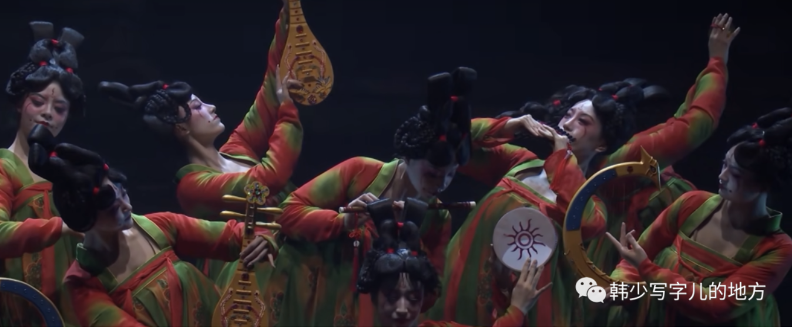

## 盛唐之音

我们该如何描述盛唐，我们该如何赞美盛唐。

### 一、青春、李白

唐代历史揭开了中国古代最为灿烂夺目的篇章。以高阶级流动性为特点的官阶爵禄身份日益代替世袭的门阀士族身份。一条充满希望前景的新道路在向更广大的黎民百姓开放，决定一个人身份地位的不再是出身而是能力。

（盛唐最动人的地方是整个时代真的有一种向上生长的开阔感。一个社会只要让人觉得前面有路，它的审美气质就会不一样。人不再只守着自己的出身和位置，而开始相信凭能力、凭才华、凭意志可以改变命运。这样的时代，天然会生长出明亮、自信、昂扬的艺术。）

无所畏惧无所顾忌地引进和吸收、无所束缚无所留恋地创造和革新，打破框架，突破传统，这就是盛唐之音的社会氛围和思想基础。一种丰满的、具有青春活力的热情和想象，渗透在盛唐文艺之中。即使是享乐、颓丧、忧郁、悲伤，也仍然闪烁着青春、自由和轻盈。这就是盛唐艺术，它的典型代表就是唐诗。

春江潮水连海平，海上明月共潮生。  

滟滟随波千万里，何处春江无月明。  

江流宛转绕芳甸，月照花林皆似霰。  

空里流霜不觉飞，汀上白沙看不见。  

江天一色无纤尘，皎皎空中孤月轮。  

江畔何人初见月？江月何年初照人？  

人生代代无穷已，江月年年望相似。  

不知江月待何人，但见长江送流水。  

白云一片去悠悠，青枫浦上不胜愁。  

谁家今夜扁舟子？何处相思明月楼？  

——《春江花月夜》

多么漂亮、流畅、优美、轻快哟！其实，这诗是有憧憬和悲伤的。但它是一种少年时代的憧憬和悲伤。尽管悲伤，仍感轻快，虽然叹息，总是轻盈。

张若虚的《春江花月夜》是初唐的巅峰，而以王勃为代表的四杰则在向着盛唐巅峰攀登了。于是，尚未涉世的少年空灵感伤，化为壮志满怀要求建功立业的具体歌唱。

“春眠不觉晓，处处闻啼鸟；夜来风雨声，花落知多少。”

尽管伤春惜花，但所展现的仍是一幅愉快美丽的春景图画，它清新活泼但不低沉哀婉。这就是盛唐之音。

“醉卧沙场君莫笑，古来征战几人回。”

豪迈勇敢，一往无前，即使是艰苦战争，也壮丽无比；即使是面临危险的出征远戍，也爽朗明快。

盛唐边塞诗豪迈勇敢，而中唐则微增秋厉，而宋则凄惨，艺术审美展现了各不相同的时代特征。

（同样写征战、边地、离别，不同时代的气质会完全不同。盛唐是“我去”；中唐是“我知其艰”；宋代则更像“我已感到其不可承受”。艺术从来不会只重复题材，它真正记录的是一个时代如何感受同样的人生处境。）

盛唐巅峰当推李白，他反映了那个时代知识分子的向往：他们要求突破各种传统约束；他们渴望建功立业，进入社会上层；他们满怀抱负，纵情欢乐，肆意反抗。所有这些情感，恰恰只有当他们这个阶级在走上坡路，整个社会欣欣向荣的历史时期才有可能存在。

“天子呼来不上船，自称臣是酒中仙。”  

“但使主人能醉客，不知何处是他乡。”

李白的诗痛快淋漓，天才极致，似乎没有任何约束，毫无规律可循，却又如此美妙奇异。这是不可模仿的文字节奏，我们称之为天赋。

（李白之所以无法复制，不只是因为他天赋高，而是因为他和那个时代的上升气流结合得太彻底了。他身上那种纵横天地、傲视权贵、快意人生的气质，不只是个人性格，也是一整个盛唐时代精神在他身上的爆发。所以李白不是孤立的天才，他是时代与天才相撞之后的火花。）

### 二、音乐性的美

正如工艺和赋之于汉，雕塑、骈文之于六朝、绘画词曲之于宋元、戏曲小说之于明清，盛唐之音的艺术是诗歌与书法中的狂草。它们分别是一代艺术精神的集中点。

草书的一切都是浪漫的，创造的，天才的，一切模拟都变为抒情，一切现实存在都变为动荡情感。这不正是音乐么？是的，盛唐诗歌和书法的审美实质和艺术核心是一种音乐性的美。

——《终年帖》张旭

（“音乐性的美”这个概括太精准了。音乐最重要的不是再现一个对象，而是直接作用于人的情绪与节奏感。盛唐诗歌和狂草也是如此，它们并不主要靠细密描摹取胜，而是靠整体的旋律感、起伏感、奔放感征服你。你甚至还没完全理解内容，就已经先被它的气势裹住了。）

绝句、草书、音乐、舞蹈，这些表现艺术合为一体，把中国传统重旋律重情歌的“线的艺术”，推上了一个崭新的阶段，反映了世俗知识分子上升阶段的时代精神。而所谓盛唐之音，非他，即此之谓也。

——《唐宫夜宴》

（“线的艺术”到了盛唐，真正活了起来。它不再只是静态的形式美，而变成一种带有呼吸、力度、速度和情感温度的生命流动。诗句是线，草书是线，舞姿是线，旋律也是线。它们共同构成的，其实正是一种上扬文明的身体语言。）

### 三、杜诗颜字韩文

如果说以李白、张旭为代表的盛唐，是对旧的社会规范和美学标准的冲决和突破，其艺术特征是内容溢出形式，那么以杜甫、颜真卿为代表的盛唐，则恰恰是对艺术规范和美学标准的确定和建立，其特征是讲求形式，要求形式与内容的严格结合和统一，以树立可供学习和效仿的格式和范本。

（这点特别重要。一个时代真正成熟，不只是因为它能爆发天才，也因为它能沉淀规范。李白、张旭像洪水，杜甫、颜真卿则像河道。前者让我们看到艺术可以冲到多高，后者则让这种高度变成后来者也能进入的路径。一个文明如果只有天才而没有法度，很难形成持续传统。）

这些产生于盛唐中唐之交的封建后期的艺术典范的共同特征是，他们把盛唐气势严格地收纳凝练在一定形式、格律中。从而不再是不可学习、模仿的天才美，而成为人人可学的人工美了。虽然套上了严密形式，但也保留了前者那磅礴的气概和情感。

少陵诗法如孙吴，李白诗法如李广。李广用兵如神，却无兵法；孙、吴则是有兵法可遵循的。李白、张旭等人属于无法可循的一类，杜诗、韩文、颜字属于有法可依的一类。后者提供了后世人们学习、遵循、模仿的美的范本。从而，美的那种飘逸绝伦的贵族气质，让位于平易近人、更为通俗易懂、工整规矩的世俗风度。它更大众化，人人都可以在他们所开创建立的规矩方圆之中去寻求美、开拓美和创造美。自此艺术不再是天才们的游戏，而是普罗大众都可参与其中的实践，可称之为文学史上的一次无产阶级革命。

（所谓美的民主化，大概就是这样开始的：不再只有极少数天才能创造美，而是普通人也可以在规则之中学习美、进入美、再创造美。艺术一旦从“不可企及的神迹”变成“可以参与的实践”，它才真正成为一个文明的公共财富。）

韩文“文从字顺”，相比骈文有着突出的口语通俗性和可学性。所谓“文起八代之衰”、“韩子之文如长江大河”，其真实含义就在这里，韩文终于成为通俗意义的散文的最大先驱。

（韩愈的重要性，并不只是他反骈为散，而是他把文章从过度雕饰中解放出来，重新连回了思想、口语和表达本身。好的散文不是辞藻的堆砌，而是语言终于能顺着意思走，像水流一样自然有力。这种变化，对后来中国人的表达方式影响极深。）

直到今天，由杜甫应用的七律形式，不仍然是人们所最爱运用、最常运用的诗体么？就在七言八句五十六字这种严整规范中，人人不都可以创作出变化无穷、花样不尽的新词丽句么？它有规范而又自由，重法度却仍灵活，它们立下了美的规范。

## 韵外之致

### 一、中唐文艺

宋代文官多，官俸高，大臣傲，赏赐重，重文轻武，提倡文化。自宫廷到市井，整个时代风尚社会氛围与前期封建制度大有变化。这一切，首先是从中唐开始的。

（很多大的风格转向，其实并不是到某个朝代突然发生的，而是早在前一个阶段就已经埋下伏笔。宋的文气、雅趣、细腻、内向，并不是凭空降临，而是从中唐开始一点点生长出来的。历史真正有趣的地方，往往就在这些变化。）

真正展开文艺的灿烂图景，普遍达到诗书画各派别达到高度成就的，并不是盛唐，而毋宁是中晚唐。（风格多样化，不只有盛唐的傲）

（盛唐太耀眼了，所以后人很容易只看到它。但如果从丰富性和多样化来看，中晚唐其实更值得细看。因为盛唐像一个高峰，而中晚唐更像一整片山脉：不再只有一种气质压倒一切，而是各种题材、趣味、心境、风格一起展开。）

宗教画迅速解体，人物、牛马、花鸟、山水，各类画在中唐取得自己的独立地位并迅速发展。

总体来说，除先秦外，中唐上与魏晋、下与明末是中国古代思想领域中三个比较开放和自由的时期，这三个时期又各有特点。以世袭门阀贵族为基础，魏晋带着更多的哲理思辨色彩，理论创造和思想解放突出。明中叶主要是以市民文学和浪漫主义思潮，标志着接近资本主义的近代意识的出现。从中唐到北宋则是世俗地主在整个文化思想领域内的多样化地全面开拓和成熟，为后期封建社会打下巩固基础的时期。

（我很喜欢把中唐和魏晋、明末并列来看的视角，因为这三次开放都不是同一种开放。魏晋偏精神和哲思，明末偏市民和近代意识，而中唐到北宋则更像一种全面的文化细化与成熟。它没有那么锋利，却更持久；没有那么剧烈，却更稳固。很多后来我们以为本来如此的中国文艺形态，其实都是在这个阶段真正成型的。）

中唐的审美艺术走进了更细腻的官能感受和情感彩色的捕捉追求中。时代精神已不在马上，而在闺房；不在世间，而在心境。如果再作一次比较，战国秦汉的艺术，表现的是人对世界的铺陈和征服；魏晋六朝的艺术突出的是人的风神和思辨；盛唐是人的意气和功业；那么，中唐呈现的则是人的心境和意绪。（这是一种在开拓期后的安定）

自在飞花轻似梦，无边丝雨细如愁，宝帘闲挂小银钩。——秦观

### 二、苏轼的意义

苏轼诗文中表达出来的这种退隐的心绪，已不再只是对政治的退避，而是一种对社会的退避，而是对人生究竟有何目的和意义这个根本问题的怀疑、厌倦和祈求解脱。这便成了一种无法解脱而又要求解脱的对整个人生的厌倦和感伤。

“人生到处知何似？应似飞鸿踏雪泥。泥上偶然留指爪，鸿飞那复计东西。”

（苏轼的复杂，恰恰在于他不是单纯的旷达。很多人喜欢把他概括成豁达乐观，可真正好的地方，是他在旷达里始终带着一种无法彻底排解的人生疲惫。他不是没看见人生的荒凉，而是在看见之后，仍然努力把自己安放在一种更开阔的理解之中。）

这里没有屈原、阮籍的忧愤，没有李白、杜甫的豪诚，不似白居易的明朗，不似柳宗元的孤峭，当然更不像韩愈那样盛气凌人不可一世。苏轼在美学上追求的是一种质朴平淡的情趣韵味，一种退避社会、厌弃世间的人生理想和生活态度，反对矫揉造作和精雕细琢，并把这一切提升到透彻的哲理高度。

苏轼独特的美学理想和审美趣味，却对从元画元曲到明中叶以来的浪漫主义思潮，起了重要的先驱作用。直到《红楼梦》中的“悲凉之雾，遍布华林”，更是这一因素在新时代条件下的成果。苏轼在后期封建美学上的深远意义，其实就在这里。

（这也说明，苏轼绝不是一个只属于宋代的人物。他开启的是一整条后世审美脉络：把人生的复杂、厌倦、超脱、平淡、无可奈何与微妙情味，全都纳入美的范围之中。后来的文人艺术为什么越来越重韵味、气息、余意、平淡天真，很大程度上都能追溯到这里。）
